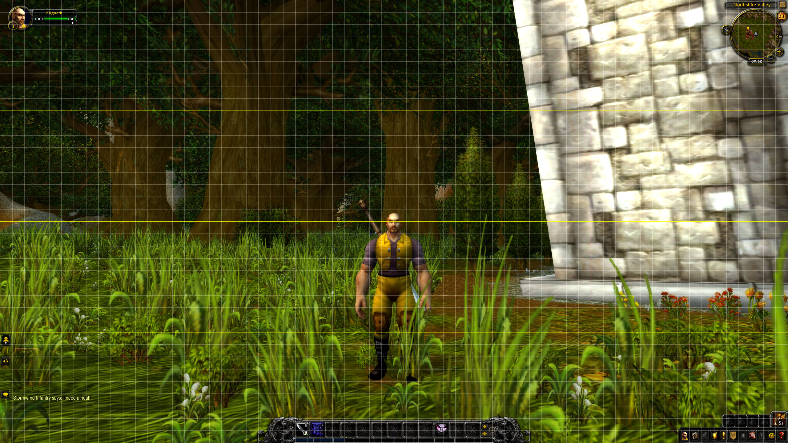

# Alignment Grid

A simple World of Warcraft AddOn that overlays a grid on-screen to aid in aligning the user interface.

To install, download the [latest release](https://github.com/BendyWalker/Alignment-Grid/releases/latest), unzip **AlignmentGrid.zip** and copy the **AlignmentGrid** folder into **[World of Warcraft Install Location] > Interface > AddOns**.

Once installed, type `/align` while in-game to turn the grid on and off. If you prefer a larger or smaller grid, append either `large` or `small`. For example, `/align large`.
